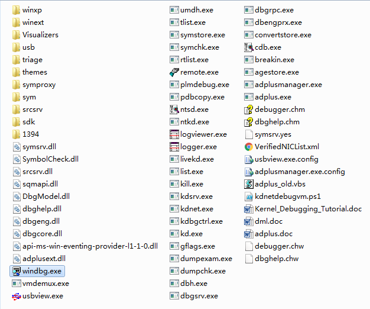
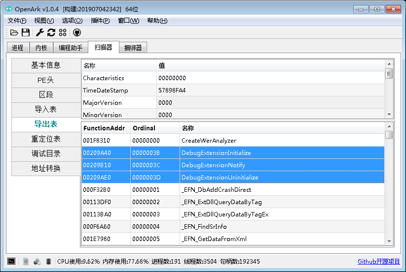
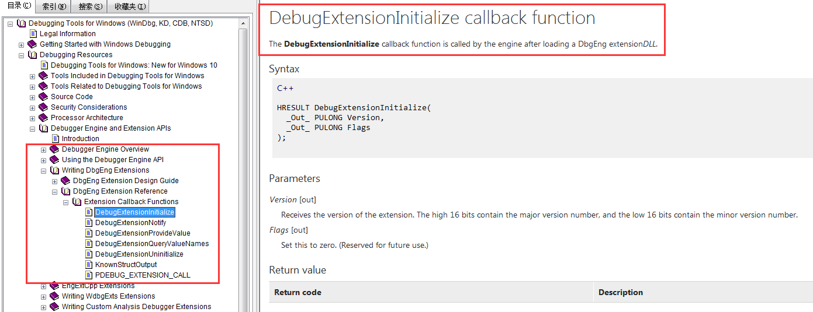
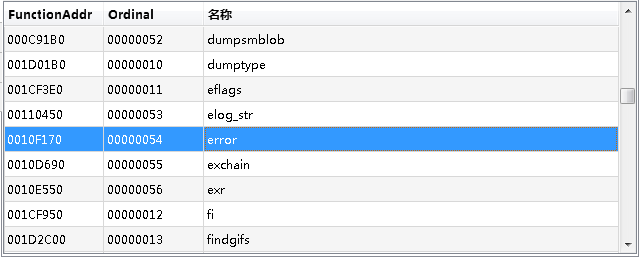
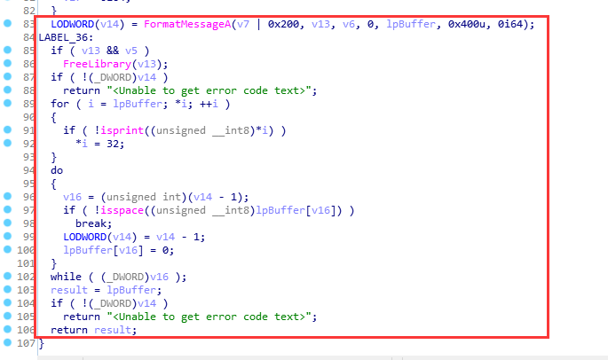

# 《Dive into Windbg系列》

* 作者：BlackINT3
* 联系：blackint3@gmail.com
* 网站：https://github.com/BlackINT3

> 《Dive into Windbg》是一系列关于如何理解和使用Windbg的文章，主要涵盖三个方面：
* 1、Windbg实战运用，排查资源占用、死锁、崩溃、蓝屏等，以解决各种实际问题为导向。
* 2、Windbg原理剖析，插件、脚本开发，剖析调试原理，便于较更好理解Windbg的工作机制。
* 3、Windbg后续思考，站在开发和逆向角度，谈谈软件开发，分享作者使用Windbg的一些经历。

## 第四篇 《Windbg脚本与插件》
> 涉及知识点：Windbg目录结构、脚本执行流程、插件开发，给官方ext插件打补丁等。

## **预备知识**
Windbg的前身是NTSD（一个命令行调试器，NTSD以前都随系统发布，Vista之后这个程序被放到Debuggers包里面去了），发行包里还有cdb.exe，可以看做是命令行的Windbg。

**程序选择**

版本选择：一般都用Windbg 10（不支持XP），笔者用的10.0.14321.1024。

平台选择：调试64位程序用x64版本，分析Dump和调试32位程序x86、x64版本。

**安装方式:**

对于较新版本的Windbg，官网已不再支持单独下载，只能通过Windows SDK里面勾选来安装，不过安装之后Redist目录会有x64/x86/arm的安装包，也可独立安装。

**目录结构:**



```
调试功能：dbgeng/dbghelp整个调试，符号解析、PE操作就和这两个模块打交道

符号下载：symsrv、symstore、symchk、pdbcopy、dbh都是和符号相关的程序，用IIS配合symstore可以自己搭建符号服务器。

远程调试：dbgsrv开启调试服务，一般远程调试lsass一些关键进程可用这个，别直接本机调试（非侵入式的查看内存的除外），因为lsass提供了很多安全相关的RPC接口，
只要Windbg有相关操作，轻轻松松死锁。

内核调试：livekd是我单独放进去的，之前的文章已经接触过了。系统自带的本地内核调试（LKD）要给引导加/debug参数，Vista开始，如果开启LKD，dbgeng会释放kldgbdrv.sys来实现内核操作，kldgbdrv.sys封装了KdSystemDebugControl，互相通信。kd开头的都是内核调试相关的程序。

系统控制：gflag功能很强大，实际上是系统安插的各种控制点（NtGlobalFlag），便于调试分析，Loader、异常、Debug相关的控制点居多。

插件目录：winxp、winext都是，看名字就知道以XP分界，看文档你会发现很多插件命令都标注了支持的系统（比如Windows XP and later）。

SDK目录：里面有开发插件的例子，值得一看。

其它的不再详细介绍，帮助文档里的Debugging Resources写得很清楚，不懂就F1。
```

## **Windbg脚本**
脚本就是一连串的命令集合，Windbg除内置的命令外，还有很多插件提供命令。执行Windbg脚本有三种方式：
  * 命令框里执行，例如：r $teb;r $peb 多条命令可用分号分隔，也可换行（命令框高度可以改变）。
  * 命令框执行脚本文件，例如$$><"c:\my_script.txt"，脚本文件里多条命令需换行或用分号分隔。
  * Windbg参数-c执行，例如windbg.exe -c "commands"
 
 **脚本执行过程**

用windbg调试另一个windbg，观察脚本的执行过程，首先在windbg!CmdExecuteCmd下断点，第一个参数则是用户输入命令。如下所示：
```
输入 bp @$exentry，程序中断到CmdExecuteCmd
----------------------------------------
Breakpoint 0 hit
windbg!CmdExecuteCmd:
00000001`3fe692a0 4056            push    rsi
----------------------------------------
可知参数1是输入的命令
0:000> du @rcx
00000000`0034f2b0  "bp @$exentry"
-----------------------------------------
```

查看当前栈回溯，可知消息来自UI线程，说明这是Edit的消息处理过程。
```
0:000> k
 # Child-SP          RetAddr           Call Site
00 00000000`000ab258 00000001`3fe673e4 windbg!CmdExecuteCmd
01 00000000`000ab260 00000001`3fe6cdd0 windbg!WinCommand::OnNotify+0x454
02 00000000`000ab2b0 00000000`77429bd1 windbg!WinBase::BaseProc+0x730
03 00000000`000ab3f0 00000000`774272cb USER32!UserCallWinProcCheckWow+0x1ad
04 00000000`000ab4b0 00000000`77426829 USER32!DispatchClientMessage+0xc3
05 00000000`000ab510 00000000`776811f5 USER32!_fnDWORD+0x2d
06 00000000`000ab570 00000000`7742685a ntdll!KiUserCallbackDispatcherContinue
07 00000000`000ab5f8 00000000`77423838 USER32!ZwUserMessageCall+0xa
08 00000000`000ab600 00000000`77426bad USER32!SendMessageWorker+0x73d
09 00000000`000ab690 000007fe`f56a54fd USER32!SendMessageW+0x5c
0a 00000000`000ab6e0 000007fe`f56a5458 MSFTEDIT!CW32System::SendMessage+0x51
0b 00000000`000ab960 000007fe`f56a86b7 MSFTEDIT!CTxtWinHost::TxNotify+0x134
0c 00000000`000ab9b0 00000000`77429bd1 MSFTEDIT!RichEditWndProc+0x228
***省略***
-----------------------------------------
```

跟踪CmdExecuteCmd，发现命令写入g_UiCommandBuffer(这里可通过内存访问断点跟踪)
```
00 00000000`000ac608 00000001`3fe78ef2 windbg!StartCommand
01 00000000`000ac610 00000001`3fe6947e windbg!AddStringCommand+0xae
02 00000000`000ac640 00000001`3fe673e4 windbg!CmdExecuteCmd+0x1de
03 00000000`000ac6a0 00000001`3fe6cdd0 windbg!WinCommand::OnNotify+0x454
```

接着就调用UpdateEngine通知Debug Engine
```
00 00000000`000ab148 000007fe`c4790d90 KERNELBASE!ReleaseSemaphore
01 00000000`000ab150 00000001`3fe7c580 dbgeng!DebugClient::ExitDispatch+0x70
02 00000000`000ab1a0 00000001`3fe78f2f windbg!UpdateEngine+0x2c
03 00000000`000ab1d0 00000001`3fe6930f windbg!AddStringCommand+0xeb
04 00000000`000ab200 00000001`3fe673e4 windbg!CmdExecuteCmd+0x6f
```

这里如果线程较多，可livekd查看信号量对象的DispatchHeader，进而找到正在等待的线程。因为本例子总共才5个线程，所以直接查看所有线程的栈，根据WaitForSingleObject句柄定位线程（前面几篇文章都有涉及如何找参数，当然你可用CodeMachine开发的cmkd插件），此时栈如下：
```
 # Child-SP          RetAddr           Call Site
00 00000000`0442f768 000007fe`fd7110dc ntdll!NtWaitForSingleObject+0xa
01 00000000`0442f770 000007fe`c4790ca2 KERNELBASE!WaitForSingleObjectEx+0x79
02 00000000`0442f810 00000001`3fe7c264 dbgeng!DebugClient::DispatchCallbacks+0xf2
03 00000000`0442f890 00000000`775259ed windbg!EngineLoop+0x604 //调试循环
04 00000000`0442f920 00000000`7765c541 kernel32!BaseThreadInitThunk+0xd
05 00000000`0442f950 00000000`00000000 ntdll!RtlUserThreadStart+0x1d
```

在该线程设置断点，例如：~13 bp ntdll!NtWaitForSingleObject+0xa，接着跟踪到windbg!ProcessCommand，此时可用wt -l2 @$ra 根据函数名跟踪。不难找到添加断点的函数，此时栈如下：
```
00 00000000`0442da20 000007fe`c47798cf dbgeng!Breakpoint::Breakpoint+0xd2(构造Breakpoint实例) 
01 00000000`0442da50 000007fe`c4857fee dbgeng!CodeBreakpoint::CodeBreakpoint+0x23
02 00000000`0442daa0 000007fe`c48338de dbgeng!MachineInfo::NewBreakpoint+0x11e
03 00000000`0442daf0 000007fe`c477c8f8 dbgeng!X86MachineInfo::NewBreakpoint+0x2e
04 00000000`0442db40 000007fe`c477f87f dbgeng!AddBreakpoint+0x1c4 => dbgeng!Breakpoint::LinkIntoList（添加到断点链表中）
05 00000000`0442db90 000007fe`c486b795 dbgeng!ParseBpCmd+0x2f7 //断点命令处理函数
06 00000000`0442dcf0 000007fe`c486cbdc dbgeng!ProcessCommands+0xccd
07 00000000`0442de40 000007fe`c47a04bb dbgeng!ProcessCommandsAndCatch+0xfc
08 00000000`0442ded0 000007fe`c47a07a3 dbgeng!Execute+0x2bb
09 00000000`0442e3c0 00000001`3fe798f1 dbgeng!DebugClient::ExecuteWide+0x83
0a 00000000`0442e420 00000001`3fe79d80 windbg!ProcessCommand+0x2b1
0b 00000000`0442e840 00000001`3fe7c2a2 windbg!ProcessEngineCommands+0x16c
0c 00000000`0442f890 00000000`775259ed windbg!EngineLoop+0x642
0d 00000000`0442f920 00000000`7765c541 kernel32!BaseThreadInitThunk+0xd
0e 00000000`0442f950 00000000`00000000 ntdll!RtlUserThreadStart+0x1d
```

真正写入断点（内存int 3）是在程序恢复执行时调用InsertBreakpoints时：
```
dbgeng!PrepareForExecution+0x635:
000007fe`c481ced1 f60594984b0010  test    byte ptr [dbgeng!g_EngStatus (000007fe`c4cd676c)],10h
000007fe`c481ced8 751e            jne     dbgeng!PrepareForExecution+0x65c (000007fe`c481cef8)
000007fe`c481ceda 8b0518d44a00    mov     eax,dword ptr [dbgeng!g_CmdState (000007fe`c4cca2f8)]
000007fe`c481cee0 05fefeffff      add     eax,0FFFFFEFEh
000007fe`c481cee5 83f801          cmp     eax,1
000007fe`c481cee8 760e            jbe     dbgeng!PrepareForExecution+0x65c (000007fe`c481cef8)
000007fe`c481ceea e81de9f5ff      call    dbgeng!InsertBreakpoints (000007fe`c477b80c)
000007fe`c481ceef 488b1d52f34c00  mov     rbx,qword ptr [dbgeng!g_Target (000007fe`c4cec248)]
栈如下：
00 00000000`0442e638 000007fe`c49a5767 KERNELBASE!WriteProcessMemory
01 00000000`0442e640 000007fe`c48335cd dbgeng!LiveUserDebugServices::WriteVirtual+0x37
02 00000000`0442e680 000007fe`c4781158 dbgeng!BaseX86MachineInfo::InsertBreakpointInstruction+0x14d
03 00000000`0442e6e0 000007fe`c47799eb dbgeng!LiveUserTargetInfo::InsertCodeBreakpoint+0x88
04 00000000`0442e770 000007fe`c477be4d dbgeng!CodeBreakpoint::Insert+0xbb
05 00000000`0442e7d0 000007fe`c481ceef dbgeng!InsertBreakpoints+0x641
06 00000000`0442f6b0 000007fe`c47a37eb dbgeng!PrepareForExecution+0x653
07 00000000`0442f790 000007fe`c47a40e5 dbgeng!RawWaitForEvent+0x53
08 00000000`0442f850 00000001`3fe7bfd0 dbgeng!DebugClient::WaitForEvent+0xa5
09 00000000`0442f890 00000000`775259ed windbg!EngineLoop+0x370
0a 00000000`0442f920 00000000`7765c541 kernel32!BaseThreadInitThunk+0xd
0b 00000000`0442f950 00000000`00000000 ntdll!RtlUserThreadStart+0x1d
```

到此为止，命令执行的大体流程已基本分析完，dbgeng.dll代码量很庞大，文件近6M，不过程序都有符号，分析还算方便。若读者在使用Windbg时，遇到状态栏一直显示busy，命令无法执行，也可尝试调一下EngineLoop，看看该调试循环的线程卡在何处。

一点思考：一般性的研究方法是先有形的认识（整体流程），再来量化（各个参数、结构）。

 **脚本开发**

脚本开发不必多说，掌握常规的foreach，for， if else，别名，masm/c++语法等使用，遇到不懂的命令F1查询即可，Windbg的帮助文档写得很清晰易懂，一般英语水平的都能看懂。为此笔者仅分享一些写过脚本作为参考。

注意：x64和x86在调用约定上有差异，此外就是ntdll模块和ntdll32符号结构不一致，必要时候可用.effmach选择amd64或x86模式

x64监视访问的文件：
```
bp ntdll!NtCreateFile "as /msu $Name poi(r8+10);.block{.echo ${$Name}};gc"
```

x64通过PEB查看模块链：
```
dt ntdll!_LDR_DATA_TABLE_ENTRY -l InLoadOrderLinks.Flink -n FullDllName -n EntryPoint poi(ntdll!PebLdr+10)
```

x64加载模块条件断点（类似sxe ld）：
```
bp ntdll!LdrpFindOrMapDll "as /msu $Name @rcx; .block{.echo $Name;.if($spat(\"${$Name}\",\"*LINKINFO.dll*\")){}.else{gc}}"
```

r0列举所有的文件系统
```
!list  -t  nt!_LIST_ENTRY.Flink -x "dt nt!_DEVICE_OBJECT  DriverObject @@(#CONTAINING_RECORD(@$extret, nt!_DEVICE_OBJECT, Queue.ListEntry))" nt!IopDiskFileSystemQueueHead
```

r0列举对象类型
```
r $t0=nt!ObpObjectTypes;.while(poi($t0)!=0){.printf "%p\t%d\t%msu\n",poi($t0),by(poi($t0)+@@(#FIELD_OFFSET(nt!_OBJECT_TYPE,Index))),poi($t0)+@@(#FIELD_OFFSET(nt!_OBJECT_TYPE,Name));r $t0=$t0+@@(sizeof(void*));}
```

r0中断进程第一个线程启动
```
bp nt!PspUserThreadStartup "j dwo(@$proc+@@c++(#FIELD_OFFSET(nt!_EPROCESS,ActiveThreads)))==1 '';'gc'"
```

## **Windbg插件**

插件也可叫扩展，经常听到plugin、extension、addons说的都一个意思，这些都是老生常谈的术语了。可扩展性是架构设计的一大关注点，有接口可以定制，功能可以扩展，便于满足不同的业务需求，同时也是程序分解的一种方式。

Windbg也支持插件，winxp和winext是插件的默认搜索目录，加载插件用.load（直接使用!ext.xxx的方式也能加载ext插件），卸载用.unload，使用.chain能清晰看到当前加载的插件和搜索目录：
```
0:000> .chain
Extension DLL search Path:  //搜索目录
    C:\Program Files (x86)\Windows Kits\10\Debuggers\x64\WINXP;C:\Program Files (x86)\Windows Kits\10\Debuggers\x64\winext
Extension DLL chain: //当前加载的插件
    dbghelp: image 10.0.14321.1024, API 10.0.6, built Sat Jul 16 10:12:38 2016
        [path: C:\Program Files (x86)\Windows Kits\10\Debuggers\x64\dbghelp.dll]
    ext: image 10.0.14321.1024, API 1.0.0, built Sat Jul 16 10:11:44 2016
        [path: C:\Program Files (x86)\Windows Kits\10\Debuggers\x64\winext\ext.dll]
    exts: image 10.0.14321.1024, API 1.0.0, built Sat Jul 16 10:11:36 2016
        [path: C:\Program Files (x86)\Windows Kits\10\Debuggers\x64\WINXP\exts.dll]
    uext: image 10.0.14321.1024, API 1.0.0, built Sat Jul 16 10:11:32 2016
        [path: C:\Program Files (x86)\Windows Kits\10\Debuggers\x64\winext\uext.dll]
    ntsdexts: image 10.0.14393.0, API 1.0.0, built Sat Jul 16 10:20:19 2016
        [path: C:\Program Files (x86)\Windows Kits\10\Debuggers\x64\WINXP\ntsdexts.dll]
```

 **插件执行过程**

 重新调试Windbg，在Ext插件加载时下断点：sxe ld ext，栈如下：
 ```
 0:013> k
 # Child-SP          RetAddr           Call Site
00 00000000`0448ec88 00000000`7766ad2c ntdll!ZwMapViewOfSection+0xa
01 00000000`0448ec90 00000000`77661357 ntdll!LdrpMapViewOfSection+0xbc
02 00000000`0448ed40 00000000`77657cf8 ntdll!LdrpFindOrMapDll+0x469
03 00000000`0448eec0 00000000`77657b5e ntdll!LdrpLoadDll+0x148
04 00000000`0448f0d0 000007fe`fd719059 ntdll!LdrLoadDll+0x9a
05 00000000`0448f140 000007fe`c482cbb9 KERNELBASE!LoadLibraryExW+0x22e
06 00000000`0448f1b0 000007fe`c48e599e dbgeng!ExtensionInfo::Load+0x3bd //插件加载
07 00000000`0448f6a0 000007fe`c481c051 dbgeng!TargetInfo::AddSpecificExtensions+0x1a2
08 00000000`0448f6d0 000007fe`c4821033 dbgeng!NotifyDebuggeeActivation+0x7d
09 00000000`0448f750 000007fe`c47a3b65 dbgeng!LiveUserTargetInfo::WaitForEvent+0x403
0a 00000000`0448f900 000007fe`c47a40e5 dbgeng!RawWaitForEvent+0x3cd
0b 00000000`0448f9c0 00000001`3fe7bfd0 dbgeng!DebugClient::WaitForEvent+0xa5
0c 00000000`0448fa00 00000000`775259ed windbg!EngineLoop+0x370
0d 00000000`0448fa90 00000000`7765c541 kernel32!BaseThreadInitThunk+0xd
0e 00000000`0448fac0 00000000`00000000 ntdll!RtlUserThreadStart+0x1d
 ```
可知ExtensionInfo::Load即是插件的加载函数，函数接着执行ext!DebugExtensionInitialize初始化函数，到此插件加载完毕。

**插件开发**

上面提到了插件加载，接着看看插件的导出函数，插件加载和卸载，以及：



查看sdk目录下的dbgexts.cpp，可看到这些函数的原型：
```
extern "C" HRESULT CALLBACK
DebugExtensionInitialize(PULONG Version, PULONG Flags)

extern "C" void CALLBACK
DebugExtensionUninitialize(void)

extern "C" void CALLBACK
DebugExtensionNotify(ULONG Notify, ULONG64 Argument)
```
文档中也有清晰的说明：



每个插件提供的命令，对外都是导出函数，通过感叹号调用，例如ext.dll提供的!error命令：



熟悉了那sdk几个sample后，结合帮助文档就可以开发插件了。

现在插件开发基本上都用engextcpp使用C++封装，开发更便捷，sdk\samples\extcpp是个简单的例子，可直接作为模板，作者也写了些插件，后续有机会开源出来。当然你可以去找Github找一些插件工程，在上面扩充满足你的需求。

测试时经常使用.load和.unload来更新。

多看看帮助文档中的Debugger Engine and Extension APIs，虽说都是COM的设计风格，但插件本身并不是一个Windows COM组件。总之，插件能做很多事，如果在脚本和现有插件不能满足你的情况下，可以尝试去开发，甚至可以直接扩充SDK的接口。

## **实践：给Ext官方插件打个补丁**

Ext插件的!error命令查看错误时，一直提示Unable to get error code text，这是个老bug了，最新Windbg 10仍然没修复，来看看是啥情况。
```
0:000> !error 5
Error code: (Win32) 0x5 (5) - <Unable to get error code text>
```
接着调试Windbg，你可以从上面说的error导出函数入手，也可以直接从CmdExecuteCmd、ProcessCommand入手。

跟踪下去，我们找到关键函数FormatAnyStatus：
```
0:013> k
 # Child-SP          RetAddr           Call Site
00 00000000`0448d448 000007fe`c4fcf018 ext!FormatAnyStatus
01 00000000`0448d450 000007fe`c4fcf0fb ext!DecodeErrorForMessage+0x24
02 00000000`0448d490 000007fe`c4fcf1d3 ext!DecodeError+0x37
03 00000000`0448d650 000007fe`c482d87b ext!error+0x63
04 00000000`0448d6a0 000007fe`c482da49 dbgeng!ExtensionInfo::CallA+0x287
05 00000000`0448d760 000007fe`c482db51 dbgeng!ExtensionInfo::Call+0x121
06 00000000`0448d960 000007fe`c482c261 dbgeng!ExtensionInfo::CallAny+0x9d
07 00000000`0448d9a0 000007fe`c486b9d5 dbgeng!ParseBangCmd+0x4ed
08 00000000`0448de60 000007fe`c486cbdc dbgeng!ProcessCommands+0xf0d
09 00000000`0448dfb0 000007fe`c47a04bb dbgeng!ProcessCommandsAndCatch+0xfc
0a 00000000`0448e040 000007fe`c47a07a3 dbgeng!Execute+0x2bb
0b 00000000`0448e530 00000001`3fe798f1 dbgeng!DebugClient::ExecuteWide+0x83
0c 00000000`0448e590 00000001`3fe79d80 windbg!ProcessCommand+0x2b1
0d 00000000`0448e9b0 00000001`3fe7c2a2 windbg!ProcessEngineCommands+0x16c
0e 00000000`0448fa00 00000000`775259ed windbg!EngineLoop+0x642
0f 00000000`0448fa90 00000000`7765c541 kernel32!BaseThreadInitThunk+0xd
10 00000000`0448fac0 00000000`00000000 ntdll!RtlUserThreadStart+0x1d
```
IDA反编FormatAnyStatus如下：



接着在该函数的FormatMessageA下断点。
```
DWORD WINAPI FormatMessage(
  __in          DWORD dwFlags,
  __in          LPCVOID lpSource,
  __in          DWORD dwMessageId,
  __in          DWORD dwLanguageId,
  __out         LPTSTR lpBuffer,
  __in          DWORD nSize,
  __in          va_list* Arguments
);
```
执行后查看lpBuffer
```
0:013> p
ext!FormatAnyStatus+0x1f5:
000007fe`c50dded5 8bd8            mov     ebx,eax

0:013> dq rsp+20
00000000`0448d410  000007fe`c534c720 00000000`00000400

0:013> db 7fe`c534c720
000007fe`c534c720  be dc be f8 b7 c3 ce ca-a1 a3 0d 0a 00 00 00 00  ................
000007fe`c534c730  00 00 00 00 00 00 00 00-00 00 00 00 00 00 00 00  ................
```

用FormatMessageA版本的话，locale是中文的对应GBK编码，我们可用OpenArk查看一下编码（直接拷贝hex字符串即可，程序会自动过滤横线和空格）：


继续review FormatAnyStatus的代码，下面是用isprint判断，中文肯定失败了，所以最后出现错误提示。（FormatAnyStatus函数很多模块里都有，比如dbgeng.dll（里面都用宽字符了，很明显都出自同一份代码），不过ext代码还没更新）

FormatMessageA(v7 | 0x200, v13, v6, 0, lpBuffer, 0x400u, 0i64);

原因已明，如何解决？ 

1、用FormatMessageW，但是后面涉及到一系列转码，这样打补丁的代码量就多了，麻烦。
2、MSDN说dwLanguageId（参数4）可以选择语言编码，那直接用E文即可，这样我们只需要把xor rd9, rd9改成mov rd9, 0x409即可。

第二种靠谱，但xor只有3个字节，空间太小放不下mov，只有找一段空隙，用函数首尾的的0xcc距离有太远，2字节的jmp short (0xeb)跳不过去。

折中考虑，把isprint的代码给抹掉(对于英文字符，一般都没多大用)。

接下来用x64dbg调试，通过OpenArk的地址转换，在ASLR下可以很方便在IDA和Windbg之间地址转换，无需Rebase。


最终patch如下：


保存ext.dll，重新加载插件，再试!error 5，已能正常显示。


## **结束**

总结一下，要想熟练使用Windbg，首先要知道调试的基本原理，看下WRK内核是如何分发异常，调试循环又是如何进行的。对于某些特殊的实现，有代码就看代码，没代码就边猜，边监控观察，再不行就逆了它。

最后就是多翻翻Windbg帮助文档，学会总结积累，有想法后就去动手写。

千里之行，始于足下。

Thanks for reading。

```
参考资料：
Google
Windbg Help
MSDN
WRK
OpenArk https://github.com/BlackINT3/OpenArk
```
